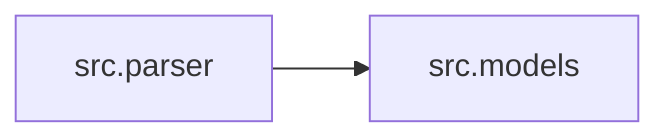

# Codex-AST Repo Mapper

**Repository Intelligence Engine** — walk a codebase with Tree-sitter, build a semantic dependency graph, and emit **token-budgeted** LLM context packs as hyper-dense XML, JSON IR, or Mermaid diagrams.

Licensed under **GNU AGPL v3**.

## Why this exists

LLMs do not need raw source dumps. They need **structure**: modules, public APIs, inheritance, and internal imports — compressed to a hard token budget.

```text
Repository → Parser → Extractor → Semantic IR → RepoGraph → Compression → Exporters
                                                              ├─ XML
                                                              ├─ JSON
                                                              └─ Mermaid
```

## Install

```bash
pipx install poetry
poetry install
poetry run codex-ast-mapper --help
```

## Demo

```bash
poetry run codex-ast-mapper --dir . --lang python --max-tokens 800
asciinema play docs/demo/map-repo.cast
```

See [docs/demo/map-repo.md](docs/demo/map-repo.md).

## Usage

```bash
# Default: hyper-dense XML for LLM developer context
poetry run codex-ast-mapper --dir . --lang python --max-tokens 4000

# JSON IR with edges + importance scores
poetry run codex-ast-mapper --format json --mode review -m 3000 -q

# Mermaid module dependency diagram
poetry run codex-ast-mapper --format mermaid --mode planning -o graph.mmd

# Show top graph hubs on stderr
poetry run codex-ast-mapper --graph-stats --dir .
```

| Flag | Description |
|------|-------------|
| `--dir` / `-d` | Repository root |
| `--lang` / `-l` | `python` \| `typescript` \| `go` \| `all` |
| `--format` / `-f` | `xml` \| `json` \| `mermaid` |
| `--mode` | `developer` \| `review` \| `planning` \| `docs` \| `refactor` |
| `--max-tokens` / `-m` | Hard Tiktoken (`cl100k_base`) budget |
| `--graph-stats` | Print module/edge hubs on stderr |
| `--output` / `-o` | Write artifact to a path |
| `--quiet` / `-q` | Hide diagnostics |

## Output shapes

### XML (default)

```xml
<repo>
  <m id="src.parser">
    <imp src="src.models" names="FileMeta"/>
    <c name="ParsedFile">
      <f name="walk" args="root:Path" ret="list[Path]">
        <doc>Walk root honoring gitignore.</doc>
      </f>
    </c>
  </m>
</repo>
```

### JSON

Includes `modules`, `edges` (`imports` / `inherits` / …), and per-module `importance` scores for downstream tools.

### Mermaid



## LLM modes

| Mode | Prioritizes |
|------|-------------|
| `developer` | Full signatures, docs, imports |
| `review` | Public APIs; helpers stripped early |
| `planning` | Aggressive compression (types abbreviated, no docs) |
| `docs` | Docstrings + public signatures |
| `refactor` | High-centrality modules, inheritance, fan-in |

When over budget: strip helpers → docs → type abbreviations → imports → **drop lowest-importance modules first**.

## Architecture

| Layer | Module |
|-------|--------|
| Walk + parse | `src/parser.py` |
| Scoped extraction | `src/ast_extractor.py` |
| Graph + importance | `src/graph.py` |
| Exporters | `src/exporters/` |
| Budget | `src/tokenizer_util.py` |
| CLI | `src/cli.py` |

## Benchmarks

```bash
poetry run python benchmarks/run_bench.py
```

Example (this repository, local run):

| files | modules | edges | wall_s | files_per_s | tokens | compression_ratio | rss_mb | prune_level |
| --- | --- | --- | --- | --- | --- | --- | --- | --- |
| 21 | 21 | 349 | 0.23 | 90 | 4449 | 22.18 | ~83 | none |

Re-run locally for machine-specific numbers. Compression ratio is raw source characters ÷ emitted tokens.

## Use cases

- **LLM context packs** — feed `--format xml` into agent prompts under a hard budget
- **Review** — `--mode review` for public API surfaces
- **Planning** — `--format mermaid` for dependency orientation
- **Tooling** — `--format json` for editors, bots, and CI checks

## Roadmap

| Version | Focus |
|---------|--------|
| **0.2** (current) | Semantic IR, RepoGraph, JSON/Mermaid, modes, importance pruning |
| **0.5** | Call graphs, cross-module references |
| **1.0** | Repository Intelligence Platform |
| **2.0** | LLM-native semantic repository OS |

## Development

```bash
poetry run ruff check src tests
poetry run ruff format src tests
poetry run mypy src
poetry run pytest -q
```

## License

[GNU Affero General Public License v3.0](LICENSE)

This project uses **AGPL-3.0** (not GPL-3.0) so that network-hosted or
service-wrapped deployments of the tool must also offer corresponding source.
That is a deliberate copyleft choice for this suite — not an unexamined default.

## Related projects

| Project | Role |
|---|---|
| [codex-ast-mapper](https://github.com/dranshrad/codex-ast-mapper) | Compress repositories into token-budgeted LLM context |
| [llm-cst-refactorer](https://github.com/dranshrad/llm-cst-refactorer) | Format-preserving typing & docstring refactors |
| [automated-self-correction-loop](https://github.com/dranshrad/automated-self-correction-loop) (ASCL) | Execute → diagnose → heal loop |
| [voice-notes-to-anthropic-artifacts](https://github.com/dranshrad/voice-notes-to-anthropic-artifacts) | Local STT → Anthropic → `~/Artifacts` |
| [anthropic-audio-gateway](https://github.com/dranshrad/anthropic-audio-gateway) | Browser audio ↔ realtime provider adapters |
